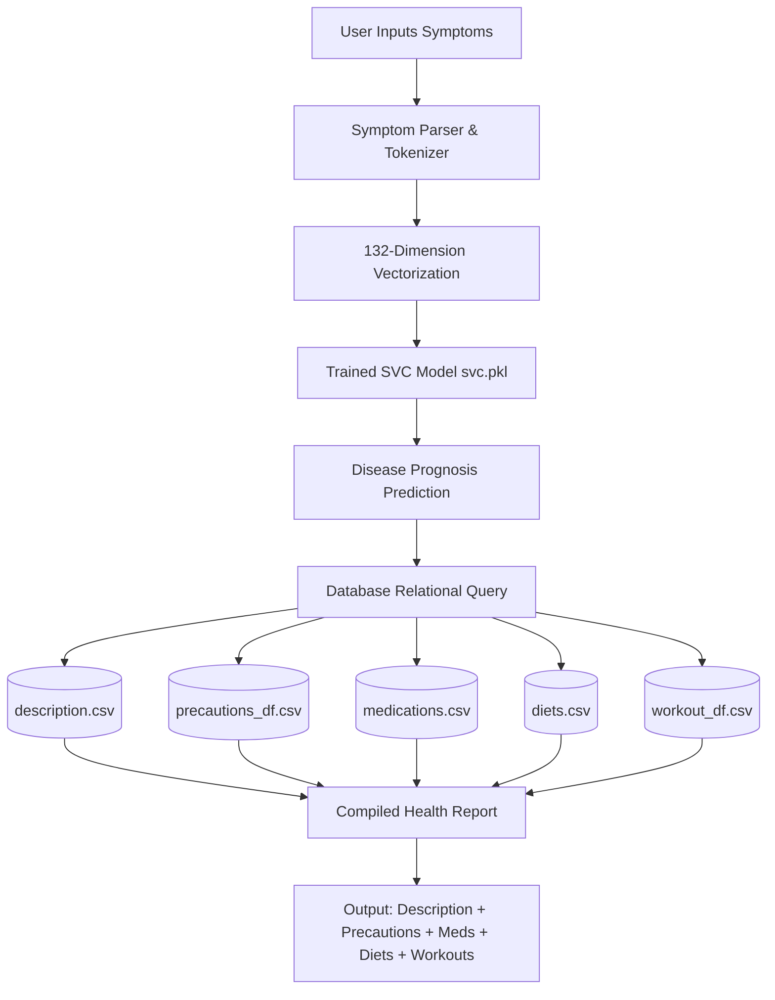

# 🩺 AI-Powered Medical Recommendation System

Welcome to the **Medical Recommendation System**, an intelligent machine learning-based diagnostic assistant. This system utilizes a trained Support Vector Classifier (SVC) to predict potential diseases based on user-provided symptoms and generates a comprehensive, personalized prescription plan—including disease descriptions, precautions, medications, diets, and exercise/workout routines.

Developed with precision and structured for real-world analytical evaluation, this repository is maintained and authored by **Vipin Kumar Singh**.

---

## 📋 Table of Contents
1. [Project Overview](#-project-overview)
2. [System Architecture](#%EF%B8%8F-system-architecture)
3. [Key Features](#-key-features)
4. [Dataset Directory Structure](#-dataset-directory-structure)
5. [Machine Learning Models & Evaluation](#-machine-learning-models--evaluation)
6. [Installation & Requirements](#-installation--requirements)
7. [How It Works & Usage](#-how-it-works--usage)
8. [Disclaimer](#-disclaimer)
9. [Author Info](#-author-info)

---

## 🔍 Project Overview

In modern healthcare informatics, bridging the gap between automated diagnostic predictions and actionable wellness recommendations is a key focus. This project uses machine learning to classify diseases from a 132-dimension symptom vector and automatically queries corresponding relational databases to retrieve tailored suggestions for the patient.

The core classifier is trained on symptoms categorized across various bodily systems, producing robust, quick, and reliable classifications. 

---

## 🛠️ System Architecture

The following flow diagram illustrates the end-to-end processing pipeline of the recommendation system:



---

## 🌟 Key Features

* **Symptom-based Classification:** Maps 132 distinctive human symptoms (such as joint pain, muscle wasting, mood swings, shivering, etc.) to 41 unique diseases.
* **Support Vector Classifier (SVC):** Powered by an optimized SVC with a linear kernel, demonstrating exceptional accuracy.
* **Comprehensive Patient Reports:** Automatically aggregates data from 6 different relational databases to deliver an all-in-one health report:
  * **Disease Description:** A clear explanation of the diagnosed illness.
  * **Precautions:** Up to 4 critical precautions to mitigate risk.
  * **Medications:** Standard medications used for treatment.
  * **Diets:** Highly recommended dietary habits.
  * **Workouts:** Curated exercises and physical training advice.
* **Pre-trained Serialized Model:** Saves computation time by exporting the trained SVC model using `pickle` for instant loading and inference.

---

## 📂 Dataset Directory Structure

The system leverages several preprocessed datasets located in the root and `/datasets` directories:

* **`Training.csv`**: Contains historical clinical samples mapped from binary symptom indicators to disease prognoses.
* **`Symptom-severity.csv`**: Categorizes symptom weight values used for grading symptom intensity.
* **`datasets/symtoms_df.csv`**: Reference list of symptom categories and indices.
* **`datasets/description.csv`**: Outlines the clinical definition of each disease.
* **`datasets/precautions_df.csv`**: Multi-tiered preventive measures mapped to each condition.
* **`datasets/medications.csv`**: Outlines suggested active pharmaceutical ingredients or standard prescriptions.
* **`datasets/diets.csv`**: Curated dietary plans for targeted nutrition.
* **`datasets/workout_df.csv`**: Recommended routines and active recovery regimens.

---

## 📊 Machine Learning Models & Evaluation

The training process includes a comparative analysis across multiple state-of-the-art classifier models. Below are the training performance results:

| Classifier Model | Testing Accuracy | Confusion Matrix Summary | Status |
| :--- | :---: | :---: | :---: |
| **Support Vector Classifier (SVC)** | **100%** | Perfect diagonal alignment | **Selected & Saved** |
| Random Forest Classifier | 100% | Perfect diagonal alignment | Evaluated |
| Gradient Boosting Classifier | 100% | Perfect diagonal alignment | Evaluated |
| K-Nearest Neighbors (KNN) | 100% | Perfect diagonal alignment | Evaluated |
| Multinomial Naive Bayes | 100% | Perfect diagonal alignment | Evaluated |

*Note: The high accuracy is due to the structured nature of the training dataset. For deployment and maximum mathematical margin separation, the **Support Vector Classifier (SVC)** was selected and serialized to [svc.pkl](file:///c:/Users/Vipin%20Kumar%20Singh/OneDrive/Desktop/Medical%20Recommdation%20System/models/svc.pkl).*

---

## 💻 Installation & Requirements

To set up the project locally on your machine, follow these steps:

### 1. Prerequisites
Ensure you have **Python 3.12+** installed on your system.

### 2. Clone the Repository
```bash
git clone https://github.com/VipinSinghRajput70/Medical-Recommadation-System.git
cd "Medical Recommdation System"
```

### 3. Install Dependencies
Install the required scientific computing, web, and machine learning packages:
```bash
pip install -r requirements.txt
```

---

## 🚀 How It Works & Usage

You can explore the training pipeline and run disease predictions directly through the Jupyter Notebook.

### Running the Notebook
1. Open your terminal in the project directory and start Jupyter Lab or Jupyter Notebook:
   ```bash
   jupyter notebook
   ```
2. Open the [medical.ipynb](file:///c:/Users/Vipin%20Kumar%20Singh/OneDrive/Desktop/Medical%20Recommdation%20System/medical.ipynb) file.
3. Run the cells sequentially to load the dataset, train/compare models, and test the helper prediction functions.

### Code Snippet: Interactive Prediction Flow
The core prediction and recommendation engine operates as follows:

```python
import pickle
import numpy as np
import pandas as pd

# Load the trained SVC model
svc = pickle.load(open("models/svc.pkl", "rb"))

# Load datasets
description = pd.read_csv("datasets/description.csv")
precautions = pd.read_csv("datasets/precautions_df.csv")
medications = pd.read_csv("datasets/medications.csv")
diets = pd.read_csv("datasets/diets.csv")
workout = pd.read_csv("datasets/workout_df.csv")

# Input symptoms from patient
user_symptoms = ["itching", "skin_rash", "nodal_skin_eruptions"]

# Convert user symptoms into 132-dimension binary vector and predict...
# (See get_predicted_value function inside medical.ipynb for full implementation)
```

---

## ⚠️ Disclaimer

> [!WARNING]
> This Medical Recommendation System is built for educational, research, and technical demonstration purposes only. It is **not** a replacement for professional clinical advice, diagnosis, or treatment. Always consult a qualified medical professional or doctor before making health decisions or taking any medication listed in the system.

---

## 👤 Author Info

* **Developer:** Vipin Kumar Singh
* **GitHub Profile:** [@VipinSinghRajput70](https://github.com/VipinSinghRajput70)
* **Project Repository:** [Medical-Recommadation-System](https://github.com/VipinSinghRajput70/Medical-Recommadation-System)

If you find this project useful, feel free to star the repository and contribute to its enhancement!
